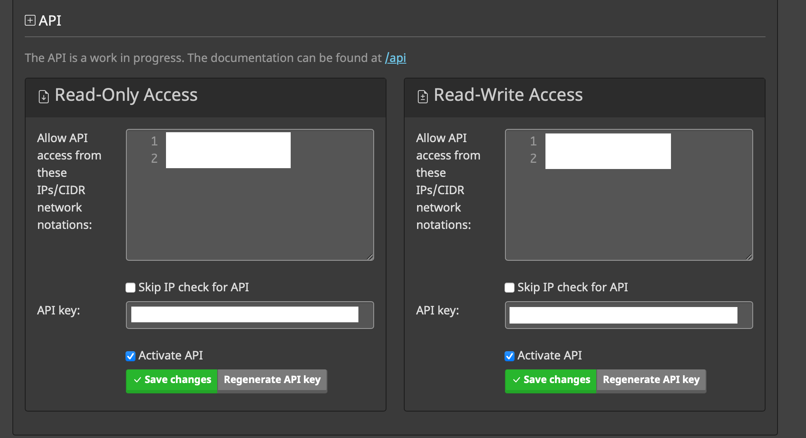

# Mailcow ruby scripts

I migrated my mailserver from a standalone postfix+dovecot to a [mailcow](https://mailcow.email) installation in several Docker containers. The problem I had was that I had 422 aliases, spread over several domains, and entering them all by hand on the website seemed…tedious. Luckily, mailcow has a good API and while I am not a web developer, I tried to hack a script together to automate this process.
As this script only needs to be run several times, I chose to munge aliases data from postfix by hand. you basically have to change the format. I'll explain this [here](#data-munging)

The list of available [Functions](Functions.md):

* [getMailboxes(domain)](Functions.md)
* [getAliases(id)](Functions.md)
* [getDomainAliases(mailbox)](Functions.md)
* [addAlias(aliasEmail, mailbox)](Functions.md)
* [getBlacklist(domain)](Functions.md)
* [addBlacklist(domain, email)](Functions.md)
* [addBlacklistList(domain, emails)](Functions.md)
* [addAliasesFromHash(aliasHash)](Functions.md)
* [getDKIM(domain)](Functions.md)


# Installation
python is not my forte, and ruby was an old love of mine, so this script is written in ruby. It requires the following libraries:

* 'json'
* 'net/http'

I installed these libraries using 

```
gem install json
gem install net-http
```

# Usage
All the code is contained in the `addalias.rb` file. Place server specific sensitive data, like hostname and api keys in a `secrets.rb` file, which is included in the main script, but excluded from git commits.

The requested actions I put at the end of the `addalias.rb` file.


# Preparation

## secrets.rb

Because you don't want any credentials or tokens on public repositories, I placed these in a `secrets.rb` file, which is included in the `.gitignore`, so it is never uploaded to the github repository.
I have created a `secrets-sample.rb` with an example of the contents.
You should duplicate this as `secrets.rb` and change the variable values.

### Host
`$BaseURL` contains the hostname where the mailcow api is hosted. 

### API Keys
You need to create one or two API keys, on the `admin` page of your mailcow installation.


If you only want to experiment first with the fetch scripts without making irreversible changes to you mailcow installation, create and use the `Read-Only Access` API. Then, when you're ready to add aliases and domains, create and add the `Read-Write Access` API key.

## Alias data munging

I could write ruby to read the postfix aliases files, but this is a hassle, as they're filled with old remarks etc. Some sanitising was necessary anyway!
So, instead I decided to rewrite the aliases to ruby compatible format myself, using a trusty text editor. BBEdit in my case.

#### postfix aliases:
```
example.com      just your regular example domain
axel@example.com        you
amazing@example.com     you
```

This needs to be rewritten and added to the `aliases.rb` file:
#### ruby aliases:
```
$aliases = {
	"axel@example.com" => "you@example.com",
	"amazing@example.com" => "you@example.com"
}
```

With some regular expressions and a good editor this should be a couple of minutes work.
e.g. this is what I used:

find `^(\S*)\s+(\S*)$`

replace with: `"\1" => "\2@example.com",`

